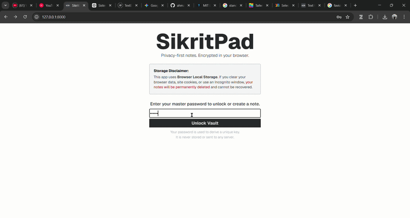

# SikritPad

SikritPad is a browser-based, client-side encrypted notepad designed with a focus on privacy and modular architecture.
This project demonstrates advanced web development concepts,
including the Web Crypto API, asynchronous JavaScript, and a clean separation of concerns.

## Key Features

- Client-Side Encryption: All cryptographic operations occur within the browser context. Plaintext notes and passwords are never transmitted to a server.
- Zero-Backend Architecture: Utilizes browser LocalStorage for persistence, ensuring user data remains under their direct control.
- High-Entropy Key Derivation: Employs PBKDF2 with a high iteration count to mitigate brute-force risks.
- Authenticated Encryption: Uses AES-GCM to ensure both confidentiality and integrity of the stored data.

## Architecture Overview

The project follows a modular design pattern to ensure maintainability and testability.
The codebase is organized into specialized modules, each with a single responsibility.

### 1. State Management (`src/app/state.js`)
The application uses a centralized state object as the single source of truth.
This prevents state fragmentation across the UI and ensures that sensitive data (like encryption keys) can be systematically purged after use.

### 2. Cryptographic Layer (`src/crypto/crypto.js`)
This module abstracts the complexity of the Web Crypto API. It handles:
- Key Derivation: Using PBKDF2 (SHA-256) with 200,000 iterations and a static salt to derive both a 128-bit Note ID and a 256-bit AES key.
- Encryption/Decryption: Implementing AES-GCM with a unique 128-bit Initialization Vector (IV) for every save operation to prevent replay attacks and pattern analysis.

### 3. Storage Abstraction (`src/storage/storage.js`)
A clean wrapper around the LocalStorage API. By decoupling storage from the core logic,
the application remains flexible for future migrations to other storage engines like IndexedDB or cloud-based providers.

### 4. UI Logic (`src/ui/ui.js`)
Handles all DOM manipulations and event bindings. It follows a "passive view" pattern,
where the UI does not contain business logic;
instead, it delegates actions to the application controller and updates its state based on the provided data.

### 5. Application Orchestrator (`src/app/app.js`)
Acts as the controller that wires the UI, Crypto, and Storage modules together.
it manages the high-level application flow, such as handling password submission and note persistence.

## Security Implementation

### Key Derivation Flow
1. User enters a password.
2. The password is fed into PBKDF2 with 200,000 iterations.
3. The resulting 384-bit output is split:
   - The first 128 bits are encoded as Base64 to serve as the Note ID (the key in LocalStorage).
   - The remaining 256 bits are used as the AES-GCM encryption key.

### Data Persistence
Notes are stored as JSON blobs containing:
- `iv`: A unique array of bytes for that specific save.
- `data`: The encrypted ciphertext.

This ensures that even if two different notes have the same content, their stored blobs will be entirely different.

## Tech Stack

- JavaScript: ES Modules (ESM) for modern dependency management.
- Web Crypto API: Native browser support for high-performance cryptography.
- CSS: Custom utility-based styling for a responsive and lightweight interface.
- HTML5: Semantic markup for accessibility.

## License

MIT License - see [LICENSE](./LICENSE) file for details
